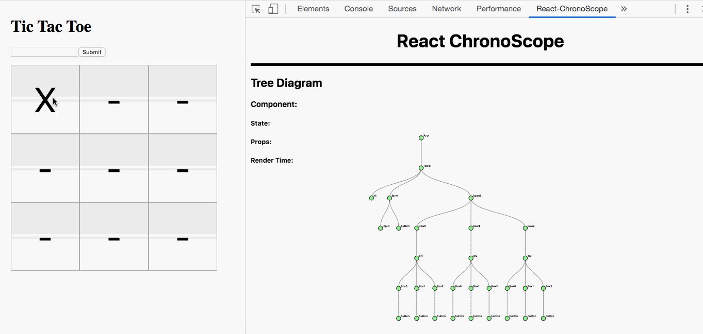

<p align="center">

<br/>

</p>

# 
<h3 align="center"> Developers' tool to monitor React performance and pinpoint areas </br> that require further optimization</h3>

# 

### What Is React ChronoScope?

<p>
React ChronoScope is a performance monitoring tool for React developers. It visualizes React application's components displaying components that require further optimization.

React ChronoScope parses through the React application to construct an interactive tree diagram of the component hierarchy.

<p align="center">
  
</p>

### How To Install 

1. Download the [extension](https://chrome.google.com/webstore/detail/react-chronoscope/haeiefchakokoggcngggkfbgklaifbbm) from the Chrome Web Store. 

2. Install the [npm package](https://www.npmjs.com/package/react-chronoscope) in the React application.

```
npm i react-chronoscope
```

3. Import the npm library into root container file of React Application and invoke the library with the root container. 

```
import chronoscope from 'react-chronoscope';
const container = document.querySelector('#root');
render(
    <App />,
    container,
    () => chronoscope(container)
);
```

### How To Use
After installing both the Chrome Extension and the npm package, run the react application in the browser. Then open Chrome Developer Tools (Inspect) on the React Application and click on ``` React ChronoScope ``` at the top of the Developer Tools panel.

### Features
- Node-collapsible tree diagram that displays all hierarchy tree components of a React application. 
- Each Node has information vital for debugging and development such state, props and how optimized is the rendering process.
- Color legend: </br>
    -  `- component was unnecessarily re-rendered.`
    -  `- component was re-rendered`
    -  `- component was not re-rendered`

- Timeline that illustrates when each component renders. 

</p>

## Team

- **Jason Huang** - [https://github.com/jhmoon999]
- **Jimmy Mei** - [https://github.com/Jimmei27]
- **Matt Peters** - [https://github.com/mgpeters]
- **Sergiy Alariki** - [https://github.com/Serrzhik]
- **Vinh Chau** - [https://github.com/Vchau511]

## License

This project is licensed under the MIT License - see the [LICENSE](LICENSE) file for details